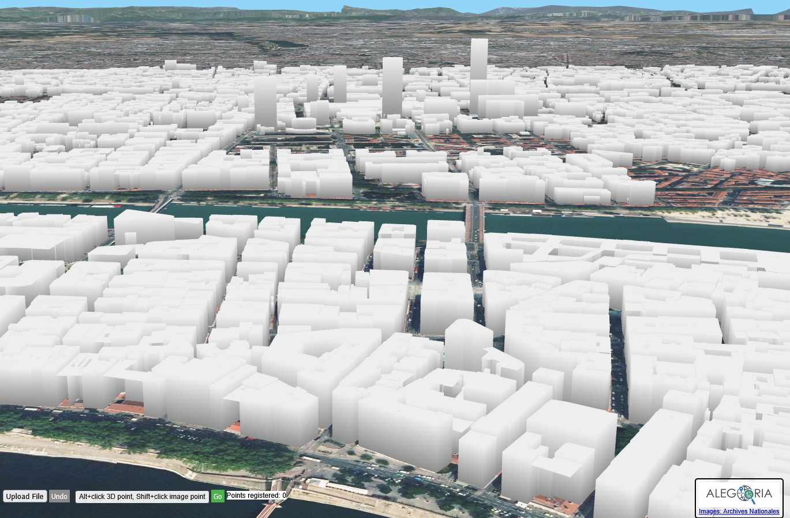

# alegoria4agape

<p align="center">
  
  <br><br>
  
</p>

This repository supports the **AGAPE** project and is based on the previous
**Alegoria** project from [`itownsResearch/alegoria`](https://github.com/itownsResearch/alegoria).
The name **alegoria4agape** reflects that relationship: this project makes use
of Alegoria's tools and code as a foundation for AGAPE.

Tools for the semi-automatic registration of historical images and their
visualisation.


## Which setup should I choose?

There are two ways to install alegoria4agape. Pick one:

| | [Quick start (Docker)](#quick-start-docker) | [Manual installation (developers)](#manual-installation-developers) |
| --- | --- | --- |
| **For whom** | Everyone — first-time users, anyone who just wants to see the tools running | Developers who want to work on the code, or who cannot run Docker |
| **You install** | [Docker](https://www.docker.com/) and [Git](https://git-scm.com/) | Git, an HTTP server, [PHP](https://www.php.net/), and MicMac built from source |
| **MicMac** | Built and configured for you | You build and configure it yourself |
| **Effort** | Two commands, then wait for the first build | Several manual steps |

If you are new here, use the Quick start.

## Quick start (Docker)

### Prerequisites

You need two tools installed before you begin.

| Tool | What it is | Install |
| --- | --- | --- |
| **Git** | Version control tool, used to download this repository and its submodules | [git-scm.com/downloads](https://git-scm.com/downloads) |
| **Docker** | Runs the application in a preconfigured container, so you do not have to install PHP, Apache or MicMac yourself | See the table below |

Which Docker to install:

| Your system | Install |
| --- | --- |
| Windows | [Docker Desktop for Windows](https://docs.docker.com/desktop/install/windows-install/) |
| macOS | [Docker Desktop for Mac](https://docs.docker.com/desktop/install/mac-install/) |
| Linux | [Docker Desktop for Linux](https://docs.docker.com/desktop/install/linux-install/), or [Docker Engine](https://docs.docker.com/engine/install/) with the [Compose plugin](https://docs.docker.com/compose/install/linux/) |

Docker Desktop already includes the Compose plugin. On Linux with Docker
Engine, install the Compose plugin as well — this project uses the
`docker compose` command.

### Start Docker

Docker must be **running** before any `docker` command works — installing it is
not enough.

| Your system | How to start it |
| --- | --- |
| Windows | Open **Docker Desktop** from the Start menu. Wait until the whale icon in the system tray stops animating and the dashboard says *Engine running*. |
| macOS | Open **Docker Desktop** from Applications or Spotlight. Wait until the whale icon in the menu bar stops animating and the dashboard says *Engine running*. |
| Linux (Docker Desktop) | Launch **Docker Desktop** from your applications menu, or run `systemctl --user start docker-desktop`. |
| Linux (Docker Engine) | `sudo systemctl start docker` — and `sudo systemctl enable docker` if you want it to start at every boot. |

On Windows and macOS the engine only runs while Docker Desktop is open. Quitting
Docker Desktop stops every container.

Now check that both tools are available:

```
git --version
docker compose version
```

If both commands print a version, you are ready.

### Install and run

```
git clone --recursive https://github.com/VCityTeam/alegoria4agape
cd alegoria4agape
docker compose up --build
```

Then open:

| Page | URL |
| --- | --- |
| Visualization of oriented images | http://localhost:8080/alegoria4agape/src/oriented_images.html |
| Semi-automatic registration tool | http://localhost:8080/alegoria4agape/src/globe.html |
| Lyon — oriented images | http://localhost:8080/alegoria4agape/src/lyon/oriented_images.html |
| Lyon — globe | http://localhost:8080/alegoria4agape/src/lyon/globe.html |

That's it — MicMac is built and configured for you. The first build compiles it
from source and takes a while; see [Docker in detail](#docker-in-detail) to
speed that up or to change what gets built.

## What you should see

Clicking **Lyon — globe** opens the semi-automatic registration tool centred on
Lyon:



The view is a 3D globe: IGN aerial imagery draped over the terrain, with the
white extruded buildings of the IGN **BDTopo** database on top. The screenshot
looks over the Presqu'île, between the Saône and the Rhône.

The first load takes a few seconds — the terrain, imagery and building tiles are
streamed from IGN as you move, so the scene sharpens progressively. The
buildings only appear once you are zoomed in close enough (the building layer is
served at zoom level 15 only), so a fully zoomed-out globe legitimately shows no
white blocks.

The bar along the bottom is the registration toolbar:

| Control | What it does |
| --- | --- |
| **Choose files / Upload File** | Upload the historical photographs you want to register |
| **Points registered: N** | How many correspondence points you have picked so far |
| **Undo** | Remove the last picked point pair (also **Ctrl+Z**) |
| `Alt+click 3D point, Shift+click image point` | A reminder of the two picking gestures, not a button |
| **Go** | Run the MicMac resection with the points picked so far |

Registration itself is described in
[`docs/saisie-visualisation.fr.md`](docs/saisie-visualisation.fr.md).

## Navigating the 3D view

### With a mouse

| Gesture | Effect |
| --- | --- |
| **Left-drag** | Grab and rotate the globe — the point under the cursor follows it |
| **Ctrl + left-drag** | Orbit around the point you are looking at, changing the viewing angle |
| **Shift + left-drag** | Look around from where you are, without moving the camera |
| **Right-drag** | Pan sideways, parallel to the screen |
| **Middle-drag** | Move forward and backward along the view direction |
| **Mouse wheel** | Zoom in and out |
| **Double-click** | Fly to that point and zoom in on it |

### With the keyboard

| Key | Effect |
| --- | --- |
| **↑ ↓ ← →** | Pan the camera |
| **Hold `r`** | Preview the last computed orientation; release to return to your view |
| **`s`** | Switch to the street-level view |
| **`c`** | Re-centre the camera in the street-level view |
| **Ctrl+Z** | Undo the last picked point |

### On a touchscreen

| Gesture | Effect |
| --- | --- |
| **One finger** | Rotate the globe |
| **Two fingers** | Orbit, and pinch to zoom |
| **Three fingers** | Pan |

### Picking points

| Gesture | Effect |
| --- | --- |
| **Alt+click** in the 3D view | Register a 3D ground point (or a point on a building) |
| **Shift+click** in the uploaded image | Register the matching 2D point in the photograph |

Alt+click is intercepted before the navigation controls see it, so it picks a
point instead of moving the camera. Once **seven** point pairs are registered,
the MicMac computation starts automatically — you do not have to press **Go**.


## Starting and stopping the application

Run all of these from the `alegoria4agape` directory, with Docker running.

### Stop it

`docker compose up` keeps running and printing logs in your terminal. To stop
the application:

| What you want | Do this |
| --- | --- |
| Stop and keep everything | Press **Ctrl+C** in the terminal running `docker compose up` |
| Stop and remove the container | `docker compose down` |
| Stop, but keep the container to restart quickly | `docker compose stop` |

`docker compose down` removes the container, **not** your data — `data/` and
`outputs/` live in named volumes that survive it. Only `docker compose down -v`
deletes those volumes, and with them all MicMac results.

### Start it again

After the first build you no longer need `--build`:

```
docker compose up
```

Add `-d` to run it in the background so you get your terminal back:

```
docker compose up -d
```

Then follow the logs with `docker compose logs -f`, and stop it later with
`docker compose down`. Use `--build` again only after changing the `Dockerfile`
or the build arguments — edits under `src/` need just a browser refresh.

### From Docker Desktop instead

If you prefer buttons to commands, everything above is also in the Docker
Desktop dashboard:

1. Open the **Containers** tab.
2. Find the `alegoria4agape` stack.
3. Use **Start** (▶), **Stop** (■), and **Delete** (🗑) on the row.
4. Click the container name to read its logs, or use the **Open in browser**
   button to reach http://localhost:8080.

Note that stopping the container from Docker Desktop also ends the
`docker compose up` command in your terminal.

## Docker in detail

Everything in this section applies to the
[Quick start](#quick-start-docker) above. You do not need any of it to run the
application.

### How the image is built

The Dockerfile uses a multi-stage build:

1. Clone `VCityTeam/alegoria4agape` recursively, including the iTowns submodule.
2. Clone and compile `VCityTeam/micmac4agape`.
3. Copy both into a PHP/Apache runtime image.
4. Configure PHP for image uploads and long-running MicMac requests.

### Where the source comes from

The application source is not copied from your local checkout during the image
build. Docker fetches it from `ALEGORIA_REPOSITORY` with `git clone
--recursive`, and MicMac from `MICMAC_REPOSITORY`.

At **runtime**, however, `docker-compose.yml` bind-mounts your local `./src`
over the copy in the image. Edits to `src/` therefore take effect on a browser
refresh, with no rebuild needed.

### MicMac and data

The container serves the PHP application with Apache and sets:

```
MICMAC_BIN=/opt/micmac4agape/bin
```

The MicMac binaries are also on `PATH`, so `globe.html` needs no further setup.

`data/` and `outputs/` are stored in Docker named volumes by default. Docker
initializes those volumes from the image content the first time they are
created, and MicMac results remain available across container restarts.

### Build arguments

The default build uses:

```
ALEGORIA_REPOSITORY=https://github.com/VCityTeam/alegoria4agape.git
MICMAC_REPOSITORY=https://github.com/VCityTeam/micmac4agape.git
MICMAC_BUILD_PARALLEL=4
```

Raise `MICMAC_BUILD_PARALLEL` to match the cores you have to shorten the first
build. You can also build against another Alegoria or MicMac fork by changing
the arguments in `docker-compose.yml` or by overriding them manually:

```
docker compose build \
  --build-arg ALEGORIA_REPOSITORY=https://github.com/VCityTeam/alegoria4agape.git \
  --build-arg MICMAC_REPOSITORY=https://github.com/VCityTeam/micmac4agape.git \
  --build-arg MICMAC_BUILD_PARALLEL=4
```

## Manual installation (developers)

This section is the **second, alternative setup**. You do not need it if the
[Quick start](#quick-start-docker) worked for you — it covers the same
application, installed by hand. Use it if you want to develop against a local
PHP and MicMac installation, or if you cannot run Docker.

### Prerequisites

| Tool | What it is | Install |
| --- | --- | --- |
| **Git** | Downloads this repository and its submodules | [git-scm.com/downloads](https://git-scm.com/downloads) |
| **PHP** | Runs the semi-automatic registration tool (`globe.html`) | [php.net/downloads](https://www.php.net/downloads) |
| **An HTTP server** | Serves the pages — Apache, nginx, or PHP's [built-in server](https://www.php.net/manual/en/features.commandline.webserver.php) | see your server's documentation |
| **MicMac** | Photogrammetry engine, built from source | [`VCityTeam/micmac4agape`](https://github.com/VCityTeam/micmac4agape) |

### 1. Clone the repository

The alegoria4agape Web Tools use iTowns as a submodule
([`itowns-photogrammetric-camera`](https://github.com/VCityTeam/itowns-photogrammetric-camera4agape)),
so clone recursively to get the sources and the builts:

```
git clone --recursive https://github.com/VCityTeam/alegoria4agape
```

If you cloned without `--recursive`, fetch the submodule afterwards:

```
git submodule update --init --recursive
```

### 2. Serve the files

Launch your favorite http-server from the **parent directory of the clone**, not
from the clone itself — the URLs below include the `/alegoria4agape/` prefix.

### 3. Open the application

Replace `localhost` with the host and port your server uses.

| Page | URL |
| --- | --- |
| Visualization of oriented images | http://localhost/alegoria4agape/src/oriented_images.html |
| Semi-automatic registration tool | http://localhost/alegoria4agape/src/globe.html |
| Lyon — oriented images | http://localhost/alegoria4agape/src/lyon/oriented_images.html |
| Lyon — globe | http://localhost/alegoria4agape/src/lyon/globe.html |

### 4. Configure MicMac for globe.html

- On Linux, beware that in order to create the different files (ground point etc) you will need to specify write authorization. You can set an authorization recursive for the all alegoria directory like chmod -R 777 alegoria/
- Check the launchMicMac.php to verify that it can find micmac4agape and your images (micmac inputs around line 47). You might add a path to micmac4agape bin like this at the beginning of the function terminal

    //add MicMac to global Path
    $path = '/home/myusername/micmac4agape/bin';
    putenv('PATH=' . getenv('PATH') . PATH_SEPARATOR . $path);

## City, quartier, and zone configuration

This applies to both setups.

City-specific entry points live under `src/<city>/`. Lyon currently has:

- `src/lyon/oriented_images.html`
- `src/lyon/globe.html`

Both entry points reuse the shared pages in `src/oriented_images.html` and
`src/globe.html`. The city, quartier, and zone data is centralized in
`src/config/sites.js`.

To add a new city or zone:

1. Add the city under `ALEGORIA_SITES.cities` in `src/config/sites.js`.
2. Add one or more `zones` with `positionOnGlobe`, `orientedImages`, and
   `globeImages`.
3. Optionally create `src/<city>/oriented_images.html` and
   `src/<city>/globe.html` redirect files like the Lyon ones.

You can also open a configured zone directly by adding query parameters, for
example with Docker:

| Target | URL |
| --- | --- |
| Lyon, `default` zone | http://localhost:8080/alegoria4agape/src/globe.html?city=lyon&zone=default |
| Lyon, `default` quartier | http://localhost:8080/alegoria4agape/src/oriented_images.html?city=lyon&quartier=default |

> 🇫🇷 **Documentation en français** — l'utilisation des outils de **saisie** et
> de **visualisation** est décrite dans
> [`docs/saisie-visualisation.fr.md`](docs/saisie-visualisation.fr.md).
